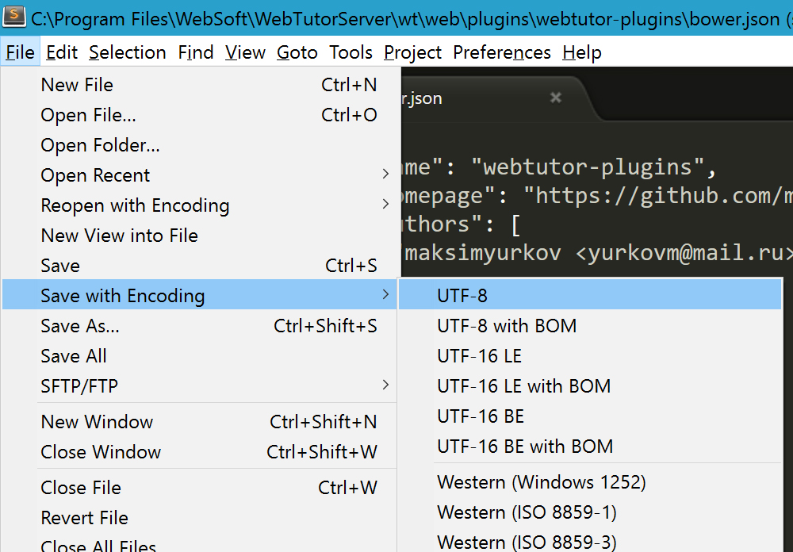

# Работа с файловой системой

| Раздел | Описание | Тип |
| :--- | :--- | :--- |
| [PutFileData()](#putfiledata) | Сохраняет содержимое строки в файл. | Встроенная |
| [LoadFileData()](#loadfiledata) | Загружает содержимое файла по заданному пути. | Встроенная |
| [getJsonFromServer()](#getjsonfromserver) | Получает содержимое json файл и преобразовывает его в объект. | Пользовательская |
| [DeleteFile()](#deletefile) | Удаляет файл. | Встроенная |
| [DeleteDirectory()](#deletedirectory) | Удаляет директорию, включая все вложенные файлы и директории. | Встроенная |
| [copyFile()](#copyfile) | Копирует файл. | Пользовательская |
| [MoveFile()](#movefile) | Перемещает или переименовывает файл. | Встроенная |
| [ObtainDirectory()](#obtaindirectory) | Проверяет, существует ли указанная директория, если нет - создает ее. | Встроенная |
| [ReadDirectory()](#readdirectory) | Возвращает массив, содержащий список файлов и вложенных директорий внутри указанной директории. | Встроенная |
| [IsDirectory()](#isdirectory) | Проверяет, является ли указанный путь директорией. | Встроенная |
| [UrlToFilePath()](#urltofilepath) | Преобразует локальный url типа file: или x-local: в путь файловой системы. | Встроенная |
| [FilePathExists()](#filepathexists) | Проверяет существует ли файл \(или директория\) по указанному пути. | Встроенная |
| [ZipExtract()](#zipextract) | Распаковывает архив. | Встроенная |

## PutFileData()
```js
/**
 * Сохраняет содержимое строки в файл. Содержимое строки интерпретируется как бинарные данные.
 * @param {String} path путь к файлу
 * @param {String} str данные
 * @return {undefined}
 */
function PutFileData(path, str) {...}

// Пример
// Создадим excel файл на сервере
excel_string = "<table border=1 cellpadding=5 cellspacing=0 style='border-collapse:collapse' width='100%'>";
excel_string += "<tr><td>ФИО</td><td>Должность</td></tr>";
excel_string += "<tr><td>Иванов Иван Иванович</td><td>Специалист</td></tr>";
excel_string += "</table>";

PutFileData(UrlToFilePath('x-local://wt/web/reports/excel_file.xls'), excel_string);
```

## LoadFileData()

```js
/**
 * Загружает содержимое файла по заданному пути, результат возвращается в виде строки, содержащей бинарные данные.
 * @param {String} path путь к файлу
 * @return {String}
 */
function LoadFileData(path) {...}

// Пример
obj = LoadFileData(UrlToFilePath('x-local://wt/web/plugins/settings.json'));
// '{"settings": "..."}'
```

## getJsonFromServer()

```js
/**
 * Получает содержимое json файл и преобразовывает его в объект.
 * @param  {String} url путь до файла 
 * @return {Object}
 */
function getJsonFromServer(url) {
  return tools.read_object(LoadFileData(UrlToFilePath("x-local://wt/web/"+url)), "json");
}
```

**Внимание**

Если возникают проблемы при преобразовании, появляются лишние символы\(кавычки, разрывы строк итд\), то попробуйте сохранить json файл "Without BOM".



## DeleteFile()

```js
/**
 * Удаляет файл.
 * @param  {String} path путь к удаляемому файлу 
 * @return {undefined}
 */
function DeleteFile(path) {...}

// Пример
DeleteFile('x-local://wt/web/reports/excel_file.xls');
```

## DeleteDirectory()

```js
/**
 * Удаляет директорию, включая все вложенные файлы и директории.
 * @param  {String} path путь до удаляемой директории
 * @return {undefined}
 */
function DeleteDirectory(path) {...}

// Пример
DeleteDirectory('x-local://wt/web/reports');
```

## copyFile()

```js
/**
 * Копирует файл.
 * @param  {String} filePath путь до файла
 * @param  {String} copyPath путь до места копирования
 * @return {undefined}
 */
function copyFile(filePath, copyPath) {
  PutFileData(copyPath, LoadFileData(filepath));
}

// Пример
copyFile('x-local://wt/web/assets/file.txt', 'x-local://wt/web/assets/copy/copy.txt');
```

## MoveFile()

```js
/**
 * Перемещает или переименовывает файл.
 * @param {String} path исходный путь к файлу 
 * @param {String} newPath новый путь к файлу 
 * @return {undefined}
 */
function MoveFile(path, newPath) {...}

// Пример
// Переименовать папку
MoveFile(UrlToFilePath('x-local://wt/web/yunato-console-master/'), UrlToFilePath('x-local://wt/web/yunato-console/'));
```

## ObtainDirectory()

```js
/**
 * Проверяет, существует ли указанная директория, если нет - создает ее.
 * @param  {String} path путь до файла
 * @param  {Boolean} copyPath создавать всю цепочку родительских директорий, если они не существуют. Необязательный аргумент.
 * @return {undefined}
 */
function ObtainDirectory(path, isRecursive) {...}

// Пример
ObtainDirectory('x-local://wt/web/plugins/name/', true);
```

## ReadDirectory()

```js
/**
 * Возвращает массив, содержащий список файлов и вложенных директорий внутри указанной директории. Каждый элемент массива будет содержать url вложенного файла или директории.
 * @param  {String} dirUrl путь до файла
 * @return {Array}
 */
function ReadDirectory(dirUrl) {...}

// Пример
ReadDirectory('x-local://wt/web/assets/');
/**
["value":"x-local://wt/web/plugins/course/bower.json",
"value":"x-local://wt/web/plugins/course/bower_components",
"value":"x-local://wt/web/plugins/course/data"]
*/
```

## IsDirectory()

```js
/**
 * Проверяет, является ли указанный путь (или url) директорией.
 * @param  {String} path путь
 * @return {Boolean}
 */
function IsDirectory(path) {...}

// Пример
IsDirectory('x-local://wt/web/plugins/test/readme.txt');
// false
```

## UrlToFilePath()

```js
/**
 * Преобразует локальный URI типа file: или x-local: в путь файловой системы.
 * @param  {String} URI локальный URI
 * @return {String}
 */
function UrlToFilePath(URI) {...}

// Пример
UrlToFilePath('x-local://wt/web/plugins/akismet/plugin-config.json');
// "C:\Program Files\WebSoft\WebTutorServer\wt\web\plugins\akismet\plugin-config.json"
```

## FilePathExists()

```js
/**
 * Проверяет существует ли файл (или директория) по указанному пути.
 * @param  {String} path путь к файлу
 * @return {Boolean}
 */
function FilePathExists(path) {...}

// Пример
FilePathExists(UrlToFilePath('x-local://wt/web/plugins/akismet/plugin-config.json'));
// true
```

## ZipExtract()

```js
/**
 * Распаковывает архив.
 * @param  {String} archivePath путь до архива
 * @param  {String} destPath    путь до папки, в которую нужно распаковать
 * @return {undefined}
 */
function ZipExtract(archivePath, destPath) {...}

// Пример
ZipExtract('x-local://wt/web/assets/akismet.zip', 'x-local://wt/web/plugins/akismet/');
```